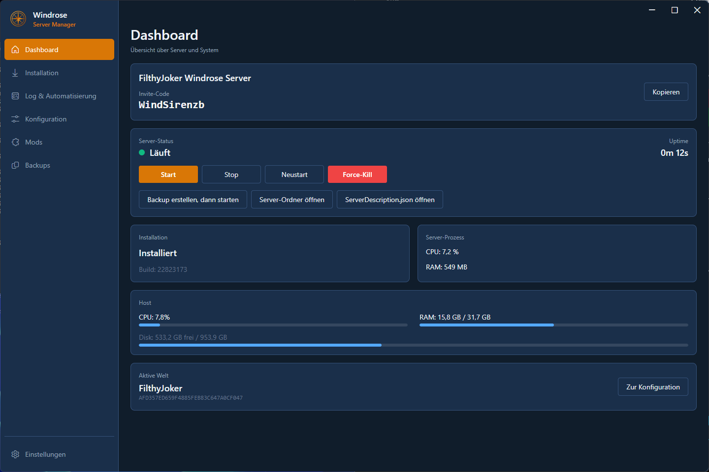
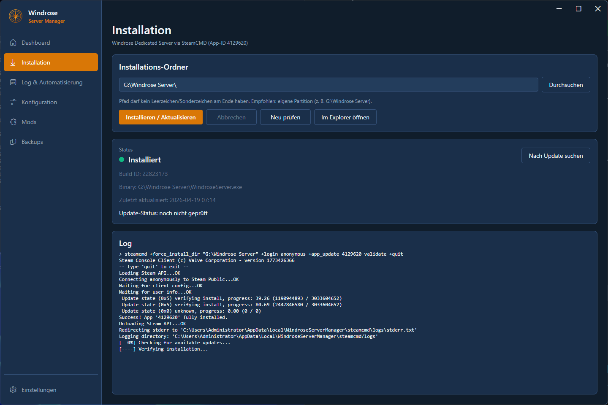
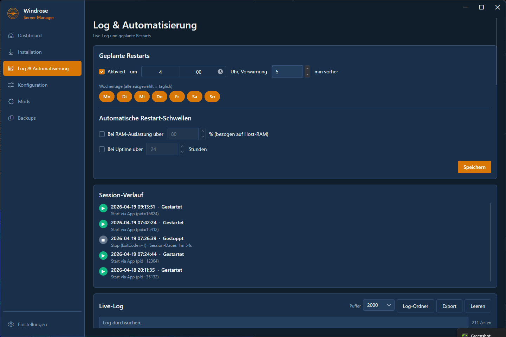
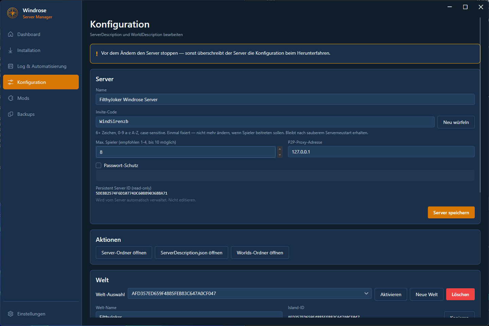
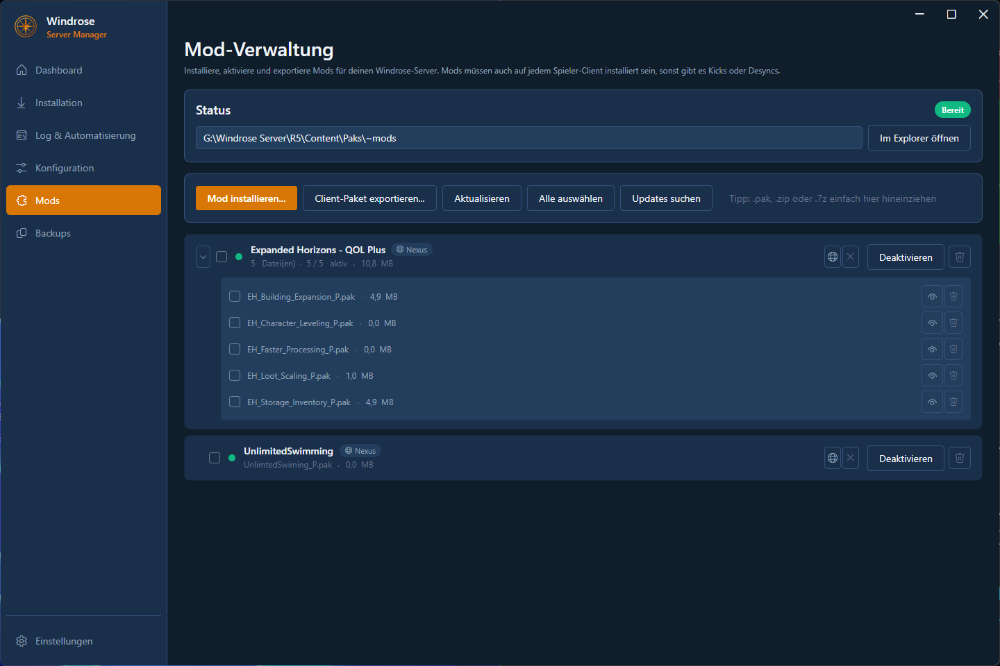
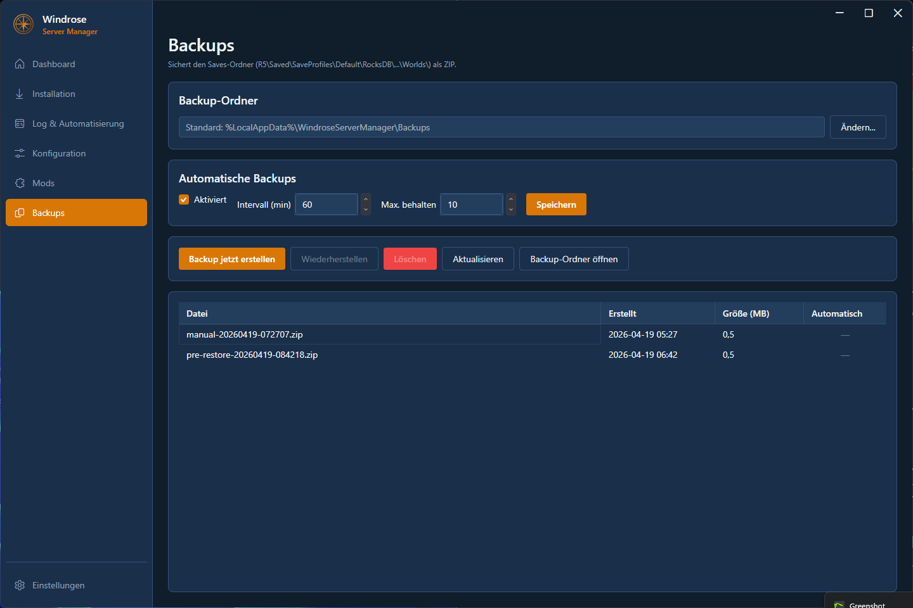
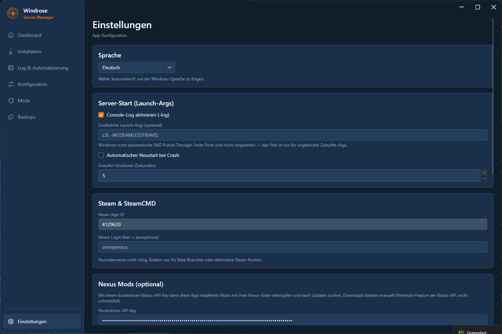

# Windrose Server Manager

**Dedicated Server Manager for [Windrose](https://store.steampowered.com/app/4129620/Windrose_Dedicated_Server/)** — a native Windows desktop app (Avalonia / .NET 9) bundling SteamCMD, server control, configuration, mods, backups, firewall rules, and update checks into a clean, modern UI.

**Status: Stable · v1.0.0**


> The UI ships in **English and German** with auto-detection from the Windows language setting (screenshots below happen to show the German UI).

---

## Features

### Dashboard
- Real-time server status (Running / Stopped / Crashed), uptime
- Prominent invite code with one-click copy
- Host metrics (CPU / RAM / Disk) with progress bars
- Server process metrics (CPU / RAM)
- Active world with a direct jump to configuration
- "Create backup, then start" — safe one-click server launch

### Installation
- Fully automated via SteamCMD (App-ID `4129620`, anonymous login)
- Live log with download progress
- Install-path picker with validation (no UNC, no special chars, not under Program Files)
- Update check via Steam build ID

### Server Control & Automation
- **Start / Graceful-Stop / Force-Kill / Restart**
- **Auto-restart on crash** (opt-in)
- **Scheduled restarts** per weekday with configurable warning time (toast)
- **Threshold-based restarts** — high RAM usage or max uptime
- **Session history** of all starts / stops / crashes with duration
- **Live log** with colour coding (errors red, warnings orange)

### Configuration
- Form-based editor for `ServerDescription.json` and `WorldDescription.json`
- Manage multiple worlds (create, activate, delete)
- Invite code generator (re-roll)
- World parameters (difficulty, mob health/damage, ship stats, …)
- Password protection with masked input

### Mod Management
- **Drag & drop** install from `.pak`, `.zip`, or `.7z` (7z via SharpCompress)
- **Automatic grouping** — mods coming from a single archive appear as one expandable mod card
- **Nexus Mods integration (free tier)** — add your API key once:
  - The mod ID is extracted from the download filename and **auto-linked** during import
  - Update check on demand: "Update!" badge when a newer version is available on Nexus
  - "Open on Nexus" — direct browser jump
- **Enable / Disable** via rename (`.pak` ↔ `.pak.disabled`) — preserves side-car metadata
- **Bulk operations**: select all, remove selected, toggle whole groups
- **Client bundle export** — ZIP of all active mods to share with players (mods must also be installed on every client)
- **Safety checks** — mod changes only while the server is stopped

### Backups
- ZIP snapshot of `R5/Saved/`
- Manual or **scheduled** (configurable interval)
- **Retention** — keep max N backups (oldest auto-backups go first)
- **Safe restore** with automatic pre-restore snapshot
- Custom backup folder

### System Integration
- **Firewall** — one-click rule (admin prompt), UDP 7777 + 7778
- **Tray icon** — Start/Stop/Show/Quit from the taskbar
- **Autostart** — HKCU Run-Key, app launches minimized to tray
- **App update check** — compares GitHub releases with local version, banner with download
- **Crash logger** — writes every crash to `%LocalAppData%\WindroseServerManager\crashes\`

### Design
- **Dark mode first** — Mica backdrop on Windows 11, seamless chrome
- Amber accent palette, Fluent icons, smooth hover transitions
- **English and German** with auto-detection from Windows language
- Toast notifications (success/warning/error/info) — click to dismiss, longer display time for errors

---

## Screenshots

> UI shown in German; an English translation is bundled and auto-selected by Windows language.

### Dashboard — status and metrics at a glance


### Installation — SteamCMD in one click


### Log & Automation — scheduled restarts and live log


### Configuration — server and world parameters


### Mods — drag & drop + Nexus integration


### Backups — scheduled + safe restore


### Settings — language, firewall, autostart, Nexus API


---

## System Requirements

- **Windows 10 (1809+)** or **Windows 11**
- ~300 MB for the app + SteamCMD
- 10–20 GB for the Windrose server itself
- Internet access (SteamCMD downloads, optional Nexus API)

No separate .NET install required — the self-contained build ships everything.

## Install

### Option A: Installer (recommended)
1. Download `WindroseServerManager-Setup-1.0.0.exe` from the [Releases page](https://github.com/ManuelStaggl/WindroseServerManager/releases)
2. Run the installer, follow the prompts
3. Launch from the Start Menu

### Option B: Portable ZIP
1. Download `WindroseServerManager-1.0.0-portable.zip`
2. Extract anywhere
3. Run `WindroseServerManager.exe`

### Option C: Build from source
```powershell
git clone https://github.com/ManuelStaggl/WindroseServerManager
cd WindroseServerManager
dotnet build src/WindroseServerManager.App
# or a release build:
.\scripts\build-release.ps1
```

## First Run

1. **Dashboard** opens with an onboarding card
2. **Installation** → pick a path → "Install / Update"
3. **Configuration** → create a world, set a server name, roll an invite code
4. **Server Control** → "Start"
5. **Settings** → add firewall rule (accept admin prompt)
6. Optional: **Settings** → enter Nexus API key for mod auto-linking
7. Optional: **Mods** → drop `.pak` / `.zip` / `.7z` files onto the page

## Paths

| Purpose | Path |
|---|---|
| Settings | `%AppData%\WindroseServerManager\settings.json` |
| App logs | `%LocalAppData%\WindroseServerManager\logs\app-YYYYMMDD.log` (rolling, 7 days) |
| Crash logs | `%LocalAppData%\WindroseServerManager\crashes\crash-*.txt` |
| SteamCMD | `%LocalAppData%\WindroseServerManager\steamcmd\` |
| Backups (default) | `%LocalAppData%\WindroseServerManager\backups\` |
| Server install | user-chosen |
| Mods | `<ServerInstallDir>\R5\Content\Paks\~mods\` |

## Nexus Mods Integration

The app uses **only the free tier** of the Nexus API — metadata reads and update checks work with any free account. API-based mod downloads are a Nexus Premium-only feature and are **not** supported here. Admins continue to download mods manually from nexusmods.com.

**Setup:**
1. Log in at [nexusmods.com](https://www.nexusmods.com/)
2. Open the [API Keys page](https://www.nexusmods.com/users/myaccount?tab=api) → generate a personal API key
3. In the app, go to **Settings → Nexus Mods** and paste the key
4. On the next ZIP import the mod ID is detected and linked automatically

## Project Layout

```
WindroseServerManager/
├── src/
│   ├── WindroseServerManager.Core/    Service layer (platform-agnostic)
│   └── WindroseServerManager.App/     Avalonia desktop UI
├── tests/
│   └── WindroseServerManager.Core.Tests/
├── scripts/
│   ├── publish.ps1              Self-contained single-file build
│   ├── build-release.ps1        Release + ZIP + optional installer
│   └── installer.iss            Inno Setup template
├── Screenshots/                 README images
└── artifacts/                   Build output
```

## Stack

- **.NET 9** · **Avalonia 12** · Semi.Avalonia (Fluent look)
- **CommunityToolkit.Mvvm** · Microsoft.Extensions.Hosting / DI
- **Serilog** (file sink, daily rolling)
- **SharpCompress** (7z support)
- Windows-specific: tray icon, HKCU Run-Key, Netsh firewall, DwmSetWindowAttribute

## Tests

54 unit tests in `tests/WindroseServerManager.Core.Tests` (xUnit):

```powershell
dotnet test
```

Covers: mod install/uninstall/enable/disable, side-car metadata I/O, Nexus URL parser, archive filename parser, ServerDescription round-trip, invite code generator, AppSettings defaults, world parameter catalog.

## License

[MIT](LICENSE) — community app, not a commercial product.

**Disclaimer:** Windrose Server Manager is an unofficial community tool. Windrose is a trademark of its respective owners. Not affiliated with or endorsed by Red Rook Games or Nexus Mods.

## Contributing

Pull requests, issues, and feature requests are welcome. For larger changes, please open an issue first to discuss the approach.
